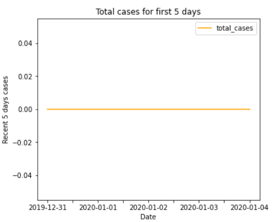
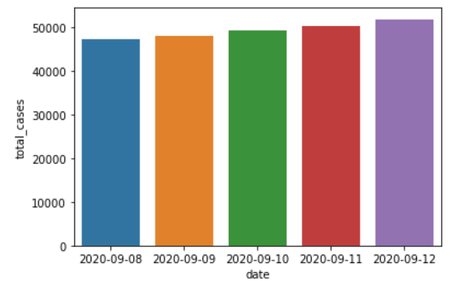
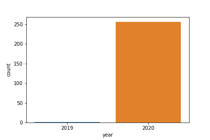
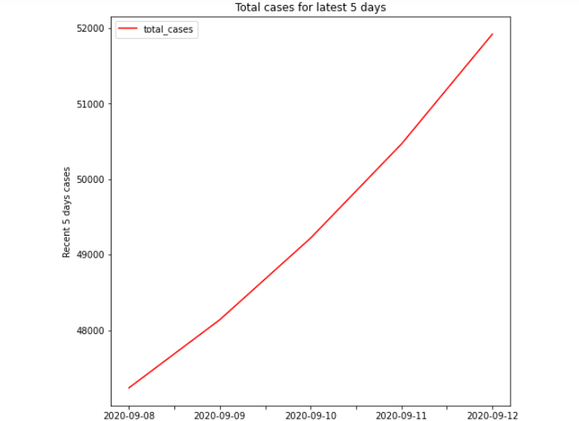
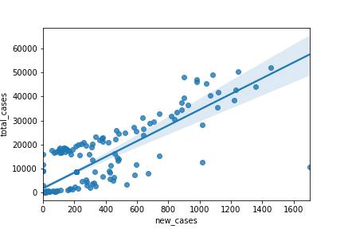
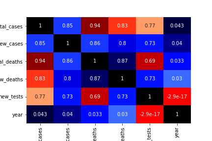
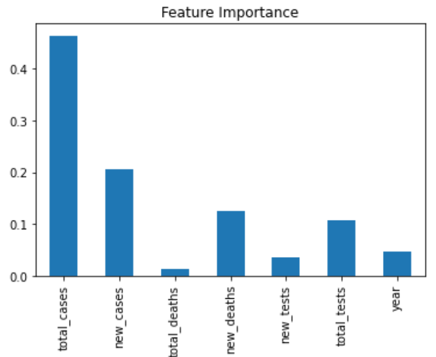

# Nepal_New_Cases_Predictor_Project Overview
* Created a model that can estimate the new COVID-19 cases of Nepal.
* Cleaned and filtered the data where I selected Nepal as a country but if we want we can select any country and proceed its case study.
* Used RandomForest Regressor model to train and built the model, also compared the accuaracy of RandomForest Regressor, KNN and Linear Regression.
* Reached around 87% of accuracy for our predition.
* Model is brought into production using Streamlit framework.https://www.streamlit.io/

# Code and Resources Used
Python version : 3.8.3
Packages: pandas, numpy, matplotlib, seaborn, scikitlearn, pickle, streamlit
For Web Framework Requirements : pip install sreamlit
# Problem Definition
The problem we are working on is regression problem where main objective is to predicting the accuracy level for new cases. In short, we can write as:

> Given a dataset of COVID-19, how well our model will predict the new cases?
# Tools
  * Numpy - for numerical operations
  * Pandas - for data analysis
  * Matplotlib - for data visualization
  * Seaborn - same use as Matplotlib with additional features
  * Scikit-Learn(Sklearn) - for machine learning modelling
  
# EDA
> Nepal First Five days case which we can see there was no any cases till first five days

> Nepal latest five days bar-chart

> Nepal corona case yearwise comparision (2019 and 2020)

> Nepal latest case line graph

> Newcases vs total cases line graph 

> Seaborn heatmap correlation

> Feature importance after imputation

# Model Building
First, I cleaned up all the data and converted all the datatypes into numerical format as machine learning model can understand numerical values only.
I also split the data in the ratio of 8:2 i.e. 80% of the data was used for train set and 20% data was used for test set.
I basically used Random Forest Regressor though I compared it with other model and it gave me the higher accuracy so I choosed RandomForest Regressor which is one of the versatile machine learning model.

# Productionization

I used spyder IDE using streamlit framework to build frontend website to enter the data and see the predicted new case of Nepal new COVID-19 cases.

